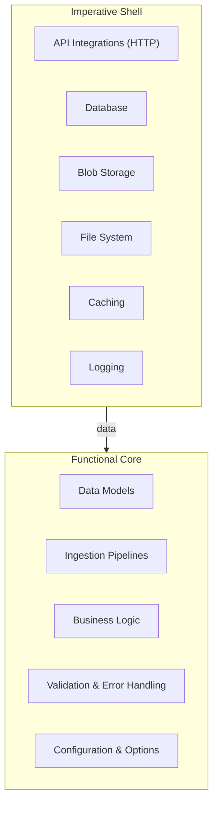

  

> [!NOTE]
> "Functional Core, Imperative Shell" is an architectural pattern that separates an application into two distinct layers: 
>  1. Purely functional core that contains all business logic without side effects
>  2. Imperative shell that handles all interactions with the external world like databases, APIs, and file systems.

## Functional Core

The functional core contains pure, testable business logic that operates only on data passed to it as parameters. It consists of pure functions that are free from side effects such as I/O operations, external state mutations, or network calls. This layer uses immutable values and returns new values rather than modifying existing state. The core is completely unaware of the shell's existence and cannot call back into it.

## Imperative Shell

The imperative shell is responsible for all side effects and external interactions. It manipulates `stdin`, `stdout`, databases, networks, file systems, and other I/O operations. In practice, the shell typically holds the core as an instance, calls it with input values, receives the returned results, and then performs imperative operations like displaying data to users or persisting it to storage.

## Interaction Pattern

The shell can call the core, but the core cannot call the shell—this is known as the Dependency Rule. The flow typically works like this: the shell reads external data (command line arguments, HTTP requests, database records), passes it to the functional core for processing, receives the result, and then writes back to external systems. When in doubt about where functionality belongs, make it functional and put it in the core to minimize imperative code.

## Implementation

FCIS aids with many of the tensions experienced throughout the development of services, packages, and systems. It provides clear guidance on where code belongs and naturally emerges in well-designed codebases.

The pattern can be portrayed as follows:

***

## Appendix

*Note created on [[2026-06-02]] and last modified on [[2026-06-02]].*

### See Also

- [Domain Driven Design (DDD)](https://en.wikipedia.org/wiki/Domain-driven_design)
- [Hexagonal Architecture](https://en.wikipedia.org/wiki/Hexagonal_architecture)
- [Ports and Adapters Architecture](https://en.wikipedia.org/wiki/Ports_and_adapters_architecture)
- [Functional Programming](https://en.wikipedia.org/wiki/Functional_programming)
- [Imperative Programming](https://en.wikipedia.org/wiki/Imperative_programming)
- [Separation of Concerns](https://en.wikipedia.org/wiki/Separation_of_concerns)
- [Single Responsibility Principle](https://en.wikipedia.org/wiki/Single_responsibility_principle)
- [Test-Driven Development (TDD)](https://en.wikipedia.org/wiki/Test-driven_development)
- [Clean Architecture](https://en.wikipedia.org/wiki/Clean_architecture)
- [SOLID Principles](https://en.wikipedia.org/wiki/SOLID)

***

(c) Jimmy Briggs <jimmy.briggs@jimbrig.com> | 2026